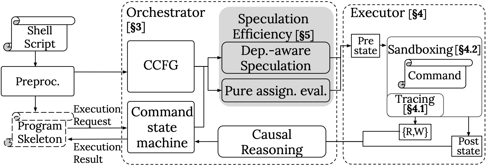

# hS Internals

## hS Overview
hS is a speculative execution system that can run shell programs in an out-of-order fashion
while maintaining equivalence to sequantial execution.
It does this by transforming and executing the program in a controlled, sandboxed manner, then
carefully reason about the dependencies to before choosing to commit, discard, or re-execute the commands it speculated

```shell
SAMPLES="ERR1233.1 ERR2445.1 ERR3771.1 ERR4462.1 ..." # a
# (1) Sanitize FASTQ file headers
for SM in $SAMPLES; do
  fastq-sanitize-header --input $SM |
    gzip > $SM/1.sanitize.fastq.gz # b
done

# (2) Genome alignments with minimap2
for SM in $SAMPLES; do
# Alignment to transcriptome and genome
  minimap2 -ax splice -t 6 ... $SM/1.sanitize.fastq.gz |
    samtools sort -o $SM/Genome.sorted.bam - minimap2 -ax map-ont -t 6 ... $SM/noribo.fastq.gz |
    samtools sort -o $SM/Transcriptome.sorted.bam - #c
done

# (3) Index genome alignment and convert to SQLite
./prep_db.sh $dbdir/sqlite.db # e
for SM in $SAMPLES; do
  dbdir=$SAMPLE_DIR/$SM # f
  samtools index $SM/Genome.sorted.bam # g
  samtools view $SM/Genome.sorted.bam |
    sam_to_sqlite --db $dbdir/sqlite.db --table genome # h
done
```



## Preprocessing

This step analyzes and transforms input shell script.

Major callpath:
```
hs (entry point)
  preprocessor/preprocessor.py:preprocess
    preprocessor/ast_transform.py:replace_ast_regions
    preprocessor/transformation.py:serialize_partial_order
  execute_script
```

`breakpoint()` at
- end of `preprocessor/preprocessor.py:preprocess_asts` to see "partial_order" files
- `preprocess_and_execute_asts` to see preprocessed script files (a.k.a. program skeleton)

Alternatively turn on `-d 2` and dig through logs

## Program Skeleton

Looking at the program skeleton we can see
- Control flow: the control flow structure is kept and
- HS_LOOP_LIST: the implicit runtime control flow hint

Inside the JIT runtime, the major call path is:
```
jit_runtime/jit.sh
  (communicates with scheduler via unix socket)
```

We will come back to this when we look at command execution

## Backend: Static

### `pdb` hack
`patch -p1 < pdb.patch` under `hs`'s root directory (pdb.patch is [here](./pdb.patch))

### Core Data Structures
Major callpath:
```
scheduler/scheduler_server.py:main
  Scheduler.run
```
scheduler/node.py:`HSProg` --- backend's representation of the shell program
`HSBasicBlock` --- backend's representation of basic block
scheduler/partial_program_order.py:`PartialProgramOrder` --- Execution state of the shell program
```Python
class CFGEdgeType(Enum):
    IF_TAKEN = auto()
    ELSE_TAKEN = auto()
    LOOP_TAKEN = auto()
    LOOP_SKIP = auto()
    LOOP_BACK = auto()
    LOOP_BEGIN = auto()
    LOOP_END = auto()
    OTHER = auto()

class HSBasicBlock:
    def __init__(self, bb_id: int, nodes: list[Node]):
        self.bb_id = bb_id
        self.nodes = nodes

class HSProg:
    basic_blocks: list[HSBasicBlock] = []
    block_adjacency: "dict[int, dict[int, CFGEdgeType]]"
```

And `Node` represents an actual command
```Python
@dataclass
class Node:
    id_: NodeId
    cmd: str
    asts: "list[AstNode]"
    basic_block_id: int
    assignment: bool
    loop_list_change: bool
```
All of these information are directly parsed from the "partial order" file

## Command Execution and Sandboxing
### Core Data Structure
scheduler/node.py:
```Python
class NodeState(Enum):
    INIT = auto()
    READY = auto()
    COMMITTED = auto()
    STOP = auto()
    SPECULATED = auto()
    EXECUTING = auto()
    SPEC_EXECUTING = auto()
    UNSAFE = auto()
    COMMITTED_UNSAFE = auto()

class ConcreteNode:
    cnid: ConcreteNodeId
    abstract_node: Node
    state: NodeState
    # exists for EXEC or SPEC_E or subsequent states, erased for READY
    exec_id: int
    # Nodes to check for fs dependencies before this node can be committed
    # for this particular execution of the main sandbox.
    # No need to do the same for the background sandbox since it will always get committed.
    to_be_resolved_snapshot: "set[NodeId]"
    # Read and write sets for this node
    rwset: RWSet
    # The wait trace file for this node
    wait_env_file: str
    # This can only be set while in the frontier and the background node execution is enabled
    # TODO: For now ignore this. Maybe there is a better way to do this.
    # background_sandbox: Sandbox

    # Exists when the node is in COMMITED or SPEC_F
    exec_result: ExecResult

    # Updated when the node is loop changing and the node is transitioning
    # into COMMITTED or SPEC_F
    loop_list_context: HSLoopListContext

    # read-only, the value of initial loop_list_context
    # used when reset_to_ready
    init_loop_list_context: HSLoopListContext

    spec_pre_env: str

    # Exists when node is in READY
    assignments: "list[NodeId]"

    # Exists when node is in EXE or SPEC_EXE, it acts as a cache for
    # the trace file content
    trace_lines: list
    # Exists when node is in EXE or SPEC_EXE, it it an opened file
    # or none when such file doesn't exist
    trace_fd=None
    trace_ctx=None
```

Major callpath:
```
Node.start_executing
  Node.start_command
    executor/executor.py:run_trace_sandboxed
      executor/run_command.sh
        fd_util -> try -> strace
```
The `env_file` is explicitly passed around. The environment capturing and restoring happens at `jit_runtime/pash_declare_vars.sh` and `jit_runtime/pash_source_declare_vars.sh`

`breakpoint()` at `scheduler/partial_program_order.py:handle_complete`, see the completed files


## Backend: Speculation
### Core data structure
scheduler/partial_program_order.py:`PartialProgramOrder`
```Python
class PartialProgramOrder:
    def __init__(self, abstract_nodes: "dict[NodeId, Node]", edges: "dict[NodeId, list[NodeId]]",
                 hs_prog: HSProg):
        self.hsprog = hs_prog
        self.concrete_nodes: dict[ConcreteNodeId, ConcreteNode] = {}
        self.frontier = set()
        # self.run_after = {}
        # Nodes that we have received "wait" for
        self.canon_exec_order: list[ConcreteNodeId] = list()
        # Nodes that we think should happen, and haven't received "wait" for
        self.spec_exec_order: list[ConcreteNodeId] = list()
        self.to_be_resolved: dict[ConcreteNodeId, list[ConcreteNodeId]] = {}
        self.temp_new_env = None
        self.current_loop_list = HSLoopListContext()
```

Major callpath:
```
scheduler/scheduler_server.py:Scheduler.run
  Scheduler.process_next_cmd
    PartialProgramOrder.handle_complete
    PartialProgramOrder.handle_wait
  PartialProgramOrder.try_schedule_spec_nodes
  PartialProgramOrder.eager_fs_killing
```
